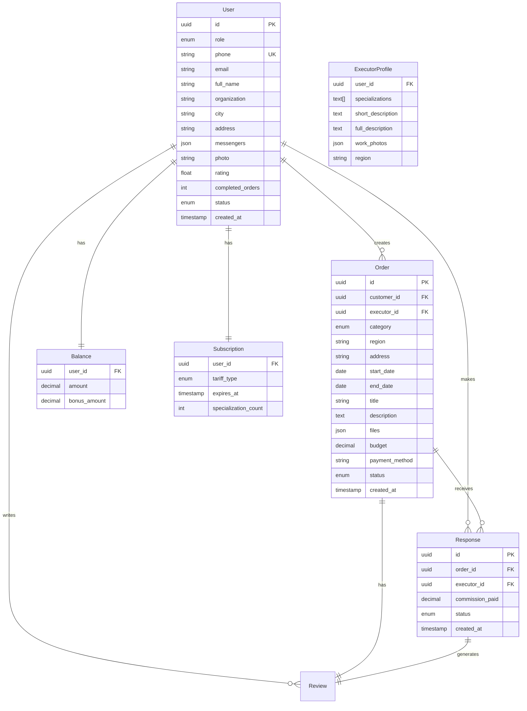

# План разработки платформы заказа монтажных услуг

## Технологический стек

**Backend:**

- **Node.js + Express.js** - быстрый и масштабируемый REST API
- **PostgreSQL** - надежная реляционная БД для транзакций и отношений
- **Prisma ORM** - type-safe работа с БД
- **Redis** - кэширование и сессии
- **Socket.io** - real-time уведомления

**Frontend:**

- **Next.js 14** (App Router) - SSR/SSG для SEO и производительности
- **TypeScript** - type-safety на всех уровнях
- **Tailwind CSS** - современный адаптивный дизайн
- **Shadcn/ui** - готовые компоненты высокого качества
- **React Query** - state management и кэширование
- **Zustand** - глобальное состояние

**Admin Panel:**

- **React Admin** или **Refine** - мощный фреймворк для админ-панели

**Интеграции:**

- **SMSC.ru API** - отправка SMS-кодов
- **Яндекс.Карты API** - отображение заказов на карте
- **ЮKassa (Яндекс.Касса)** - прием платежей от исполнителей

**Deployment:**

- **Docker + Docker Compose** - контейнеризация
- **Nginx** - reverse proxy и статика
- **PM2** - менеджер процессов Node.js

## Архитектура базы данных




## Основные модули системы

### 1. Система аутентификации и регистрации

- Регистрация заказчиков и исполнителей с выбором роли
- SMS-верификация через SMSC.ru (код подтверждения)
- Согласие с правилами сервиса (чекбокс)
- JWT токены для авторизации
- Хэширование паролей (bcrypt)

### 2. Профили пользователей

**Заказчик:**

- ФИО, организация, город, адрес, телефоны, email, мессенджеры
- ИНН/ОГРН (опционально)
- Фото профиля
- Рейтинг от исполнителей

**Исполнитель:**

- Все поля заказчика +
- Регион работы (изменяемый)
- Специализации (до 6): Окна, Двери, Потолки, Кондиционеры, Жалюзи, Мебель
- Краткое и расширенное описание
- До 5 фото работ
- Рейтинг (стартовый 3.0/5.0)
- Счетчик выполненных заказов
- Внутренний баланс (только для исполнителя)

**Бонусы при первой регистрации исполнителя:**

- 1000 бонусных рублей
- Тариф "Премиум" на 1 месяц
- Рейтинг 3.0/5.0

### 3. Система тарификации для исполнителей

**Стандарт:**

- 150₽ за каждый отклик
- Доступ к 1 специализации
- Переключение специализаций (видны только выбранные)

**Комфорт:**

- 500₽ только за взятый заказ (когда заказчик выбрал)
- Доступ к 1 специализации
- Возврат средств, если заказчик отменил заказ

**Премиум:**

- 5000₽ за 30 дней
- До 3 специализаций одновременно
- Безлимитные отклики

### 4. Размещение и управление заказами

**Создание заказа заказчиком:**

- Категория работ (выбор из справочника 6 видов)
- Регион и точный адрес
- Даты начала/окончания
- Краткое описание (заголовок)
- Подробное описание (требования, материалы, акты, фото)
- Прикрепленные файлы (PDF, изображения)
- Бюджет (минимум 5000₽ или "договорная")
- Способ оплаты (наличные, карта, безнал)

**Отображение заказов:**

- Лента заказов (список) с сортировкой по дате начала
- Карта с метками заказов (Яндекс.Карты API)
- Переключение список/карта
- Фильтр по специализации и региону для исполнителей

**Статусы заказа:**

- `published` - открыт для откликов
- `in_progress` - выбран исполнитель
- `completed` - выполнен
- `cancelled` - отменен/не состоялся
- `archived` - архивирован

### 5. Система откликов

**Для исполнителя:**

- Просмотр подходящих заказов (по региону + специализации)
- Кнопка "Взять заказ"
- Списание комиссии согласно тарифу
- Проверка баланса перед откликом
- Статус "Отклик отправлен"

**Для заказчика:**

- Получение уведомлений о новых откликах
- Просмотр профилей откликнувшихся (без контактов)
- Сравнение исполнителей (рейтинг, отзывы, фото работ)
- Кнопка "Выбрать исполнителя"

**После выбора исполнителя:**

- Раскрытие контактов обеих сторон
- Уведомление выбранному исполнителю
- Отказы остальным с мотивацией
- Заказ скрывается из общего доступа

**Автоматическое закрытие:**

- Если нет откликов до даты начала → статус `cancelled`
- Уведомление заказчику с предложением повысить цену
- Возможность переопубликовать заказ

### 6. Выполнение работ

**Workflow:**

1. Исполнитель: "Приступить к работе" → уведомление заказчику
2. Исполнитель: "Заказ выполнен" → ожидание оплаты
3. Заказчик оплачивает напрямую исполнителю
4. Исполнитель: "Закрыть заказ" → статус `completed`
5. Возможность оставить отзывы

**Отказ исполнителя:**

- Кнопка "Отказаться от заказа"
- Комиссия НЕ возвращается
- Заказ снова открыт для других откликов

**Отмена заказчиком:**

- Возврат комиссии всем откликнувшимся
- Заказ переходит в `cancelled`

### 7. Система отзывов и рейтингов

**Заказчик → Исполнитель:**

- Оценка 1-5 звезд
- Текстовый отзыв
- Влияет на рейтинг исполнителя

**Исполнитель → Заказчик:**

- Оценка 1-5 звезд (своевременность оплаты, адекватность)
- Текстовый отзыв
- Формирует репутацию заказчика

**Алгоритм рейтинга:**

- Новый исполнитель: 3.0/5.0
- Среднее арифметическое всех оценок
- Отображение в профиле и откликах
- Модерация отзывов перед публикацией

### 8. Баланс и монетизация

**Внутренний баланс исполнителя:**

- Отображение: основной + бонусный
- Пополнение через ЮKassa (карты, СБП)
- Автоматическое списание при откликах
- Приоритет списания: сначала бонусы, потом основной
- Блокировка откликов при недостатке средств
- История транзакций

**Модель дохода платформы:**

- Комиссии от исполнителей за отклики
- Подписки "Премиум"
- БЕЗ комиссий с транзакций заказчик-исполнитель

### 9. Модерация (admin-панель)

**Профили исполнителей:**

- Очередь на модерацию (статус `pending`)
- Проверка ФИО, фото, описания, специализаций
- Кнопки: Одобрить / Отклонить (с причиной)
- Изменение статуса на `active` / `rejected`

**Заказы:**

- Проверка на спам и некорректный контент
- Удаление нарушающих правила

**Отзывы:**

- Автоматическая фильтрация мата
- Ручная проверка спорных случаев
- Удаление персональных данных

### 10. Админ-панель (полнофункциональная)

**Дашборд:**

- Общая статистика (пользователи, заказы, доход)
- Графики активности
- Последние регистрации

**Управление пользователями:**

- Список заказчиков и исполнителей
- Поиск, фильтры, сортировка
- Просмотр/редактирование профилей
- Блокировка/разблокировка
- Изменение рейтинга вручную

**Модерация:**

- Очередь профилей на проверку
- Очередь отзывов
- Быстрые действия (одобрить/отклонить)

**Заказы:**

- Все заказы с фильтрами по статусу
- Просмотр деталей, откликов, переписки
- Принудительное закрытие/отмена
- Разрешение споров

**Финансы:**

- Транзакции исполнителей
- Статистика по тарифам
- Общий доход платформы
- Экспорт в Excel

**Настройки:**

- Цены тарифов (Стандарт, Комфорт, Премиум)
- Размер бонуса для новичков
- Категории специализаций
- Регионы
- Минимальная цена заказа
- Тексты уведомлений

**Аналитика:**

- Конверсия откликов в заказы
- Популярные специализации
- География заказов
- Retention пользователей
- Средний чек

### 11. Уведомления

**Каналы:**

- Email (обязательные события)
- SMS (критичные: выбор исполнителя)
- In-app (все события)
- Push (если мобильное приложение в будущем)

**События:**

- Новый отклик на заказ
- Выбор исполнителя
- Отказ от заказа
- Исполнитель приступил к работе
- Заказ выполнен
- Новый отзыв
- Низкий баланс
- Истечение подписки Премиум
- Результат модерации

### 12. Безопасность и приватность

**Скрытие контактов:**

- До выбора исполнителя контакты обеих сторон скрыты
- После выбора - взаимное раскрытие
- В архивных заказах - частичная маскировка

**Защита от обхода платформы:**

- Контакты не индексируются поисковиками
- Watermark на фото работ исполнителей
- Запрет на указание контактов в описаниях

**GDPR compliance:**

- Согласие на обработку ПД при регистрации
- Политика конфиденциальности
- Возможность удаления аккаунта

### 13. UI/UX особенности

**Дизайн в стиле youdo.com:**

- Светлая тема (primary)
- Минималистичный, современный
- Акцент на карточках (заказы, профили, отклики)
- Переключатель Список/Карта (как на фото в ТЗ)
- Адаптивность (mobile-first)

**Карта:**

- Яндекс.Карты с метками заказов
- Кластеризация при большом количестве
- Клик на метку → превью заказа
- Фильтры на карте

**Личные кабинеты:**

- Заказчик: Мои заказы, Профиль, Уведомления
- Исполнитель: Доступные заказы, Активные, История, Баланс, Тариф, Профиль

## Структура проекта

```javascript
montaj/
├── backend/
│   ├── src/
│   │   ├── config/         # Конфиги (DB, Redis, integrations)
│   │   ├── controllers/    # Контроллеры API
│   │   ├── middleware/     # Auth, validation, error handling
│   │   ├── models/         # Prisma models
│   │   ├── routes/         # Express routes
│   │   ├── services/       # Бизнес-логика
│   │   │   ├── auth.service.ts
│   │   │   ├── sms.service.ts
│   │   │   ├── payment.service.ts
│   │   │   ├── order.service.ts
│   │   │   ├── response.service.ts
│   │   │   ├── notification.service.ts
│   │   │   └── maps.service.ts
│   │   ├── utils/          # Helpers
│   │   └── app.ts          # Express app
│   ├── prisma/
│   │   ├── schema.prisma
│   │   └── migrations/
│   ├── package.json
│   └── tsconfig.json
│
├── frontend/
│   ├── src/
│   │   ├── app/            # Next.js 14 App Router
│   │   │   ├── (auth)/     # Auth routes
│   │   │   ├── (customer)/ # Заказчик
│   │   │   ├── (executor)/ # Исполнитель
│   │   │   ├── api/        # API routes
│   │   │   └── layout.tsx
│   │   ├── components/
│   │   │   ├── ui/         # Shadcn components
│   │   │   ├── orders/     # Карточки заказов
│   │   │   ├── profiles/   # Профили
│   │   │   ├── maps/       # Яндекс.Карты
│   │   │   └── layout/     # Header, Footer
│   │   ├── lib/            # Utils, API client
│   │   ├── hooks/          # Custom hooks
│   │   └── stores/         # Zustand stores
│   ├── public/
│   ├── package.json
│   └── next.config.js
│
├── admin/
│   ├── src/
│   │   ├── pages/
│   │   │   ├── dashboard.tsx
│   │   │   ├── users.tsx
│   │   │   ├── orders.tsx
│   │   │   ├── moderation.tsx
│   │   │   ├── finances.tsx
│   │   │   └── settings.tsx
│   │   ├── components/
│   │   └── providers/
│   └── package.json
│
├── docker-compose.yml
├── nginx.conf
└── README.md
```


## План разработки (этапы)

### Этап 1: Инфраструктура и база (3-4 дня)

- Настройка проекта (monorepo)
- PostgreSQL + Prisma schema
- Redis setup
- Docker Compose
- Базовый Express API
- Next.js проект с Tailwind + Shadcn

### Этап 2: Аутентификация (2-3 дня)

- Регистрация с выбором роли
- SMS-верификация (SMSC.ru)
- JWT токены
- Middleware авторизации
- Страницы логин/регистрация

### Этап 3: Профили пользователей (3-4 дня)

- Модели User, ExecutorProfile
- CRUD профилей
- Загрузка фото (Cloudinary/S3)
- Страницы профилей заказчика/исполнителя
- Редактирование профиля

### Этап 4: Система заказов (4-5 дней)

- Модель Order
- Создание заказа (форма с валидацией)
- Загрузка файлов
- Лента заказов (список)
- Фильтры по региону/специализации
- Детальная страница заказа

### Этап 5: Карта заказов (2-3 дня)

- Интеграция Яндекс.Карты API
- Геокодирование адресов
- Отображение меток заказов
- Кластеризация
- Переключатель список/карта

### Этап 6: Система откликов (3-4 дня)

- Модель Response
- Логика откликов с учетом тарифа
- Проверка баланса
- Список откликов для заказчика
- Выбор исполнителя
- Уведомления (email, in-app)

### Этап 7: Баланс и платежи (3-4 дня)

- Модели Balance, Transaction
- Интеграция ЮKassa
- Пополнение баланса
- Списание комиссий
- История транзакций
- Страница "Баланс"

### Этап 8: Тарификация (2-3 дня)

- Модель Subscription
- Логика тарифов (Стандарт, Комфорт, Премиум)
- Переключение тарифов
- Контроль доступа к специализациям
- Страница "Тарифы"

### Этап 9: Выполнение работ (2-3 дня)

- Статусы заказа (workflow)
- Кнопки: Приступить, Выполнено, Закрыть
- Логика отказов и отмен
- Раскрытие контактов
- Автоматическое закрытие заказов

### Этап 10: Отзывы и рейтинги (3-4 дня)

- Модель Review
- Форма отзыва (после закрытия заказа)
- Расчет рейтинга
- Отображение отзывов в профиле
- Модерация отзывов (базовая)

### Этап 11: Админ-панель (5-6 дней)

- Setup React Admin / Refine
- Дашборд со статистикой
- CRUD пользователей
- Модерация профилей
- Управление заказами
- Просмотр финансов
- Настройки тарифов
- Аналитика (графики)

### Этап 12: Уведомления (2-3 дня)

- Email notifications (Nodemailer/SendGrid)
- SMS через SMSC.ru
- In-app notifications (Socket.io)
- Настройки уведомлений пользователя

### Этап 13: Тестирование и доработки (3-4 дня)

- Unit тесты (Jest)
- E2E тесты (Playwright)
- Исправление багов
- Оптимизация запросов
- SEO оптимизация

### Этап 14: Deployment (2-3 дня)

- Настройка VPS
- Docker deployment
- Nginx конфигурация
- SSL сертификаты
- CI/CD (GitHub Actions)
- Мониторинг (PM2)

## Оценка времени: 40-50 дней разработки

## Ключевые технические решения

**Безопасность:**

- Helmet.js для HTTP headers
- CORS настройки
- Rate limiting (express-rate-limit)
- SQL injection защита (Prisma)
- XSS защита (sanitize-html)